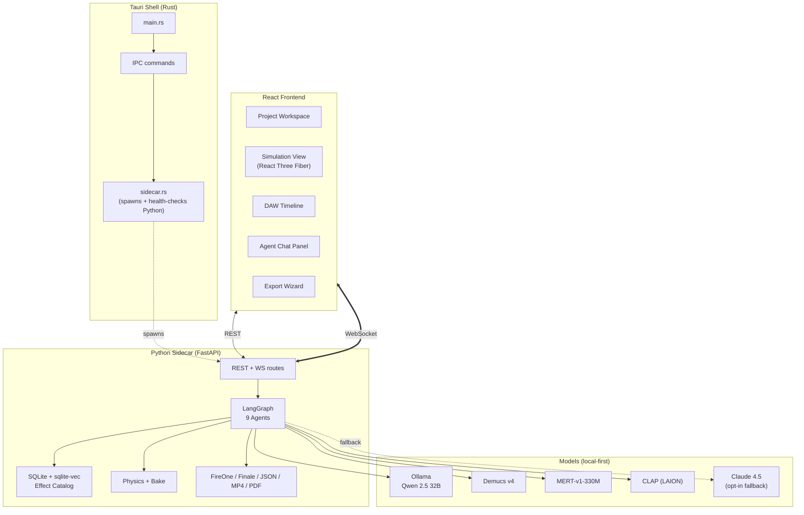
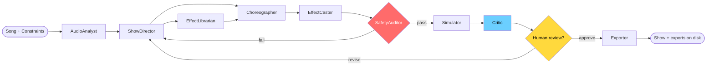
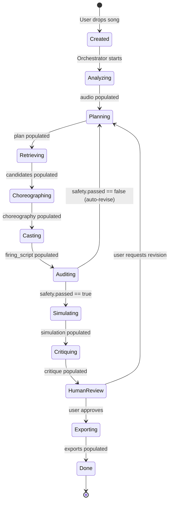
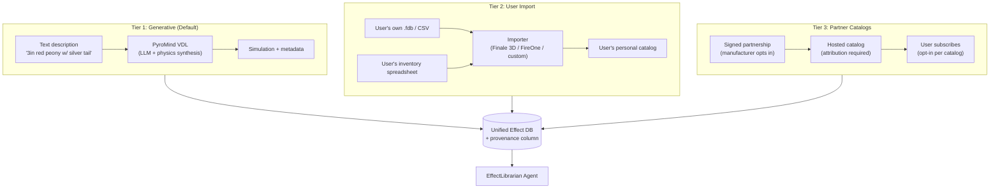
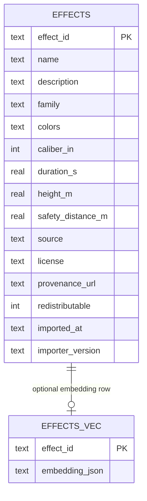
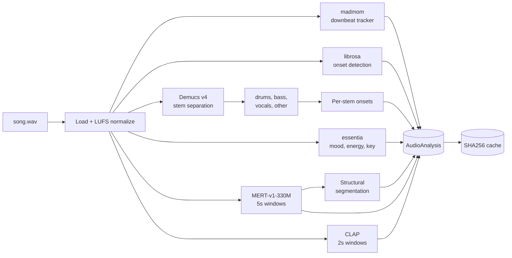
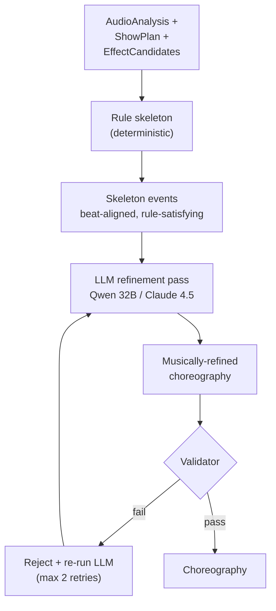
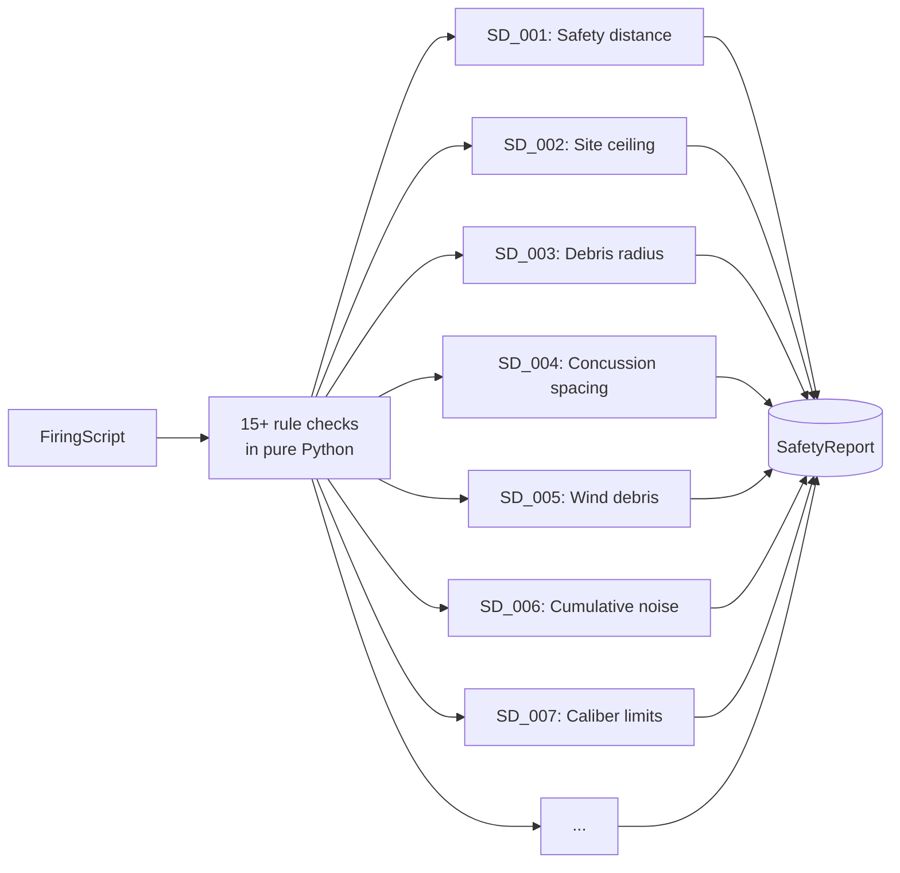
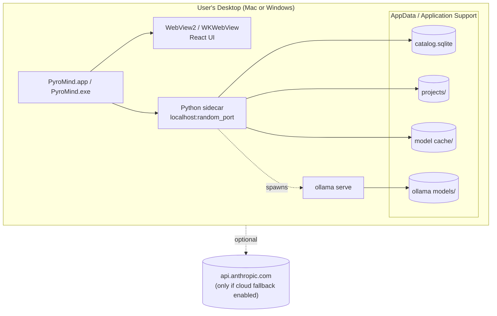
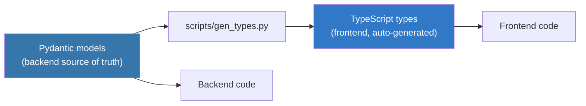

# PyroMind — Architecture

Companion to `PYROMIND_AGENT_BUILD_SPEC.md`. Diagrams and deeper explanation of the moving parts.

## 1. System overview

## 2. Agent graph (LangGraph)

## 3. State lifecycle

Every transition writes a checkpoint to SQLite. Any phase can be resumed after crash.

## 4. Catalog architecture — the three-tier strategy

PyroMind does **not** bundle anyone else's proprietary catalog. Instead, it uses a three-tier model:

**Legal tracking:** every effect in the DB has `source`, `license`, `provenance_url`, and `redistributable: bool` columns. The `EffectLibrarian` respects these — an effect marked `redistributable: false` can be used locally but is stripped from any exported share bundle.

### 4.1 Catalog SQLite schema (ER)

Phase 1 ships two tables: `effects` (authoritative rows + provenance) and `effects_vec` (placeholder for `sqlite-vec` embeddings; `embedding_json` is a stopgap until the vector extension is wired).

## 5. Finale 3D interoperability (strict legal bounds)

PyroMind interoperates with Finale 3D **through the user**, never by copying Finale's catalog:

- **Import (allowed):** Read a user's `.fdb` file or Finale-format CSV that they own a license for. Open formats that Finale itself documents for import. Map fields to our canonical schema.
- **Export (allowed):** Write a Finale-importable CSV so the user can move their PyroMind-designed show into Finale if they want.
- **VDL (allowed):** We define our own PyroMind VDL inspired by the same *concept* Finale uses (text description → simulation), but we do not use Finale's proprietary VDL strings or reverse-engineer their simulation engine.
- **Catalogs (not allowed without partnership):** We do not ship, scrape, mirror, or otherwise redistribute Raccoon, Wizard, Spirit of '76, Dominator, Lidu, NICO, Marti, Parente, RES Pyro, or any other manufacturer's catalog as hosted in Finale Inventory. Users who subscribe to those inside Finale 3D can export their *own* imported effects file and bring it into PyroMind for personal use.

## 6. Inside the AudioAnalyst

## 7. Inside the Choreographer — hybrid strategy

The rule pass guarantees correctness. The LLM pass adds musicality. The validator guarantees nothing the LLM did broke correctness.

## 8. Safety — intentionally dumb and rule-based

No LLM sees this step. Safety is too high-stakes for stochastic output.

## 9. Physical deployment on user's machine

The app is 100% functional after first-run with internet off.

## 10. Data contracts — the single source of truth

All cross-agent data types are defined in `backend/pyromind/models/*.py` as Pydantic models. A build step (`scripts/gen_types.py`) converts them to TypeScript interfaces in `frontend/src/types/generated.ts`. Both sides import from the same schema. If you change a type on one side without regenerating, CI fails.

---

*Changes to architecture require an ADR in `docs/decisions/`. Every ADR has a number, a date, a status (proposed/accepted/superseded), and the tradeoffs considered.*
